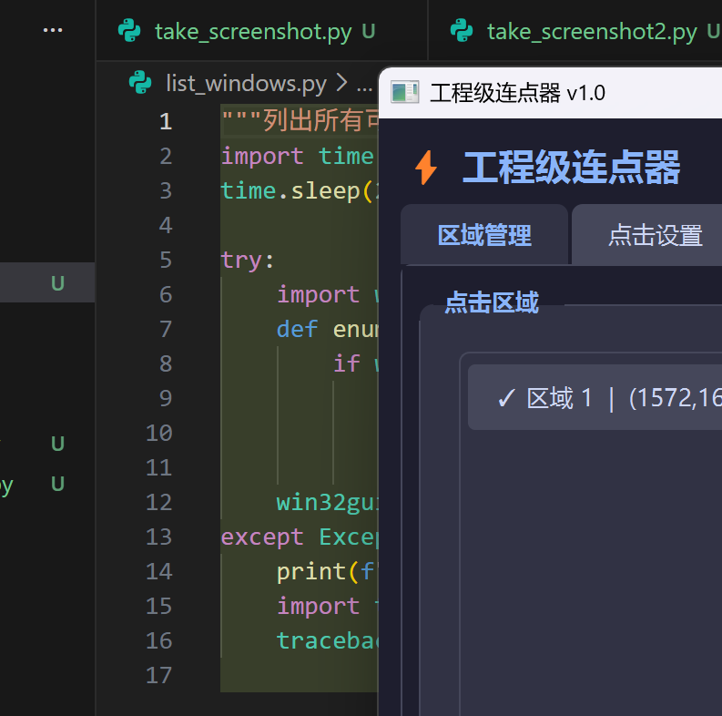

# ⚡ 工程级连点器 v1.1

高度可配置的自动点击工具，支持多区域、真人行为模拟和后台点击。

## 功能特性

| 功能 | 说明 |
|------|------|
| **热键控制** | F6 启动/停止、F7 暂停/恢复、F8/Esc 紧急停止、F9 框选区域 |
| **区域绘制** | 全屏透明覆盖层，鼠标拖拽框选，实时显示物理像素坐标和尺寸，DPI 缩放自适应 |
| **多区域点击** | 支持多个区域，顺序轮询 / 随机选择 / 加权随机 |
| **随机路径** | 贝塞尔曲线鼠标移动，ease-in-out 缓动，路径微抖动 |
| **真人模拟** | 高斯分布位置偏移、随机延迟、点击持续时间模拟、疲劳效应、随机走神暂停 |
| **后台点击** | Win32 PostMessage API，无需窗口前台焦点，自动坐标转换 |
| **配置持久化** | JSON 格式保存/加载配置，关闭时自动保存 |

## 安装

```bash
cd 连点器
pip install -r requirements.txt
```

依赖：PyQt5、pynput、pywin32、pyautogui、numpy

## 运行

```bash
python main.py
```

## 界面预览



## 热键说明

| 热键 | 功能 | 说明 |
|------|------|------|
| **F6** | 启动/停止 | 切换点击运行状态 |
| **F7** | 暂停/恢复 | 运行中暂停或恢复点击 |
| **F8** | 紧急停止 | 立即中断所有点击 |
| **Esc** | 紧急停止 | 同 F8，全局生效 |
| **F9** | 框选区域 | 进入区域选择模式 |

热键为全局热键，即使窗口未激活也能响应。支持自定义修改（热键设置 Tab）。

## 项目结构

```
连点器/
├── main.py                 # 启动入口，高 DPI 支持，暗色主题加载
├── requirements.txt        # Python 依赖（PyQt5/pynput/pywin32/pyautogui/numpy）
├── config.json             # 运行时自动生成，保存区域、热键、行为配置
├── core/
│   ├── __init__.py
│   ├── clicker.py          # 点击引擎：前台(pyautogui)/后台(Win32)双模式，
│   │                       #   多区域策略（顺序/随机/加权），线程安全启停
│   ├── humanizer.py        # 真人行为模拟：贝塞尔曲线路径生成(De Casteljau算法)，
│   │                       #   高斯分布位置偏移，疲劳效应，随机走神，3档预设
│   └── hotkey.py           # 全局热键管理器(pynput)：双策略匹配（单键直匹配+组合键），
│   │                       #   0.3s 防抖，残留键自动清理
├── gui/
│   ├── __init__.py
│   ├── main_window.py      # 主窗口：4个Tab（区域管理/点击设置/热键设置/运行日志），
│   │                       #   Qt信号线程安全回调，配置导入导出，Esc键响应
│   ├── region_selector.py  # 区域框选：全屏透明覆盖层，Win32 GetCursorPos 获取物理坐标，
│   │                       #   Qt逻辑坐标绘制，DPI缩放自适应，角标+尺寸信息显示
│   └── styles.py           # Catppuccin Mocha 暗色主题 QSS，8色区域配色方案
└── utils/
    ├── __init__.py
    └── win32_utils.py      # Win32 API 封装：PostMessage/SendMessage 后台点击，
                            #   窗口枚举(EnumWindows)，坐标转换，进程名获取
```

## 行为预设

| 预设 | 最小间隔 | 最大间隔 | 抖动 | 疲劳 | 适用场景 |
|------|---------|---------|------|------|---------|
| 快速 | 30ms | 100ms | 3px | 关 | 高频点击，速度优先 |
| 正常 | 50ms | 300ms | 5px | 开 | 通用场景，平衡速度与拟真 |
| 谨慎 | 200ms | 800ms | 2px | 开 | 需要高度拟真的场景 |

## 后台点击说明

后台模式使用 Win32 `PostMessage` 发送 `WM_LBUTTONDOWN/WM_LBUTTONUP` 消息到目标窗口，
无需将窗口置于前台。屏幕坐标自动通过 `ScreenToClient` 转换为窗口客户区坐标。

**注意**：部分使用 DirectInput 或自定义输入处理的应用可能不响应后台消息。

## 技术要点

- **DPI 自适应**：区域框选使用 Win32 `GetCursorPos` 获取物理像素坐标传给点击引擎，Qt 逻辑坐标仅用于覆盖层绘制，确保任意缩放比例下框选区域与实际点击位置一致
- **线程安全**：点击引擎运行在独立线程，通过 Qt 信号/槽机制更新 UI；引擎销毁时阻塞等待线程结束，防止回调已释放的 Qt 对象
- **热键可靠性**：双策略匹配（单键直接匹配 + 组合键匹配），残留键自动清理，0.3s 防抖防止重复触发

## 许可

仅供学习研究使用。
